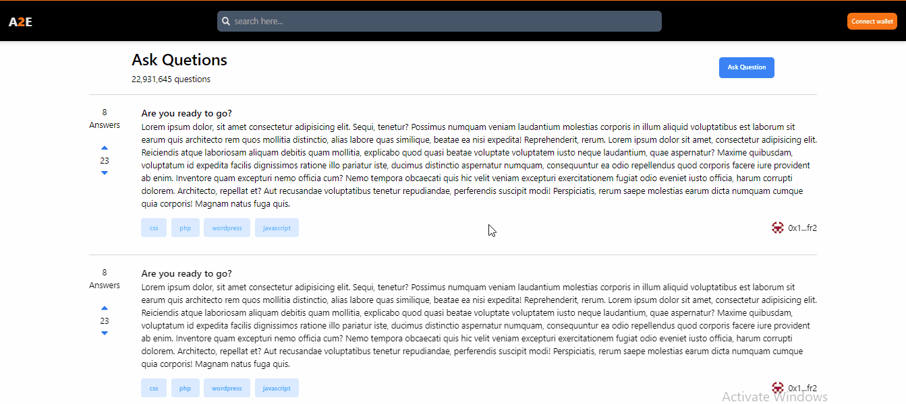

# A2E-Answer to earn

This example shows How To Build A Classic Web3 NFT Minting Dapp with React and Solidity:

<figcaption>Answer to earn project</figcaption>

## Technology

This demo uses:

- ReactJs
- Tailwind CSS

